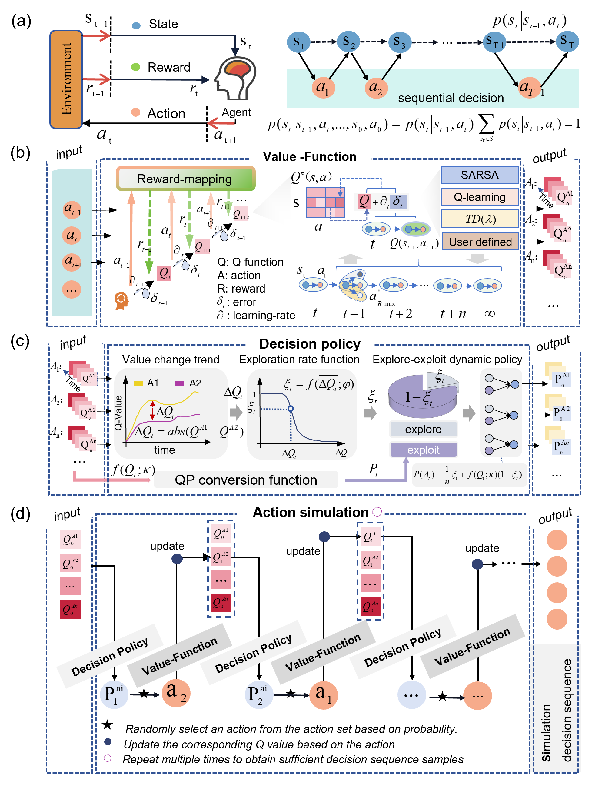
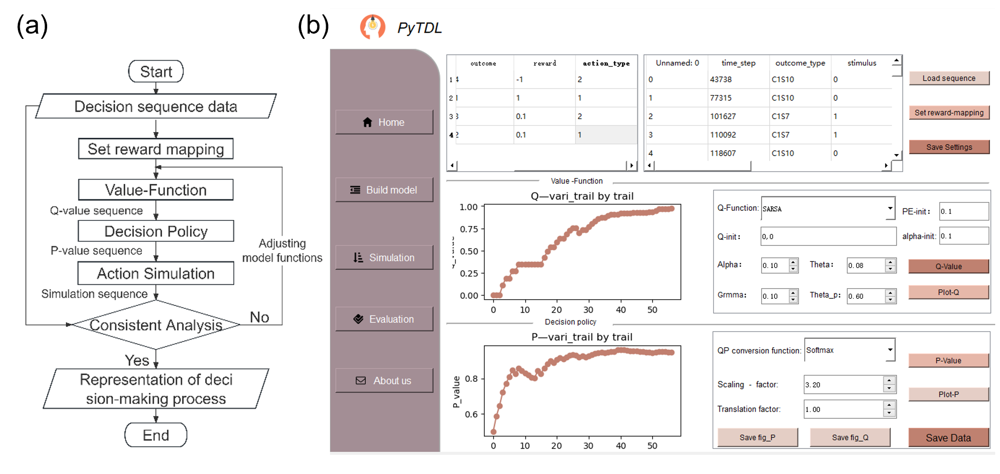

# PyTDL
PyTDL is a comprehensive Python framework designed for the modeling and simulation of biological cognitive decision-making processes. It incorporates the Temporal-Difference learning algorithm, offering a versatile tool for researchers in the field.

Licensed under the MIT License, PyTDL is compatible with Python 3.8 or newer versions. The framework's functionality relies on a range of dependencies including NumPy, Pandas, Matplotlib, PyQt5, SciPy, Seaborn, and scikit-learn. To facilitate cognitive decision-making data modeling, PyTDL emphasizes the importance of standardizing raw data into CSV format or constructing a Pandas DataFrame through Python functions. The data should encompass labels (outcomes) that pertain to behavioral decisions, ensuring compatibility with the toolkit's features.

PyTDL does not adhere to a singular model; instead, it provides a flexible framework that accommodates a variety of models and a toolbox to simulate the decision-making behavior and cognitive learning processes. Users are thus required to make informed choices regarding the use of specific value functions and decision policies to quantitatively represent the experiential behavioral processes, as well as to consider which model parameters significantly impact the decision-making modeling.
## Overview of key functional modules of PyTDL

To enhance user experience, we have developed a GUI program based on PyQt5, housed within the PyTDL_GUI folder in the same directory. This interface allows users to effortlessly employ classic value functions (e.g., Q-learning, SARSA) and decision policies (e.g., epsilon-greed, softmax), adjust model parameters in real-time, and swiftly obtain model outcomes. It also supports customization, enabling users to modify the design files in the PyTDL_GUI folder to quickly construct tools tailored to specific cognitive decision-making modeling tasks. For advanced customization, we recommend writing custom functions within the corresponding modules of the PyTDL package to improve model efficiency.
## The working flow and GUI of PyTDL

We provide two concrete examples of cognitive decision-making modeling: the go/no-go auditory discrimination task and the two-choice free task. These examples demonstrate the flexibility of the PyTDL toolkit and the modeling process by customizing nonlinear dynamic learning functions and exploration-exploitation strategy adjustments to capture the evolutionary patterns of biological decision behavior. The relevant code is presented in Jupyter Notebook format. Behavioral data collected from experiments are stored in the Behavioral Data folder, while modeling parameters and procedural data are kept in the Model Data folder within the respective decision task directories. When running Jupyter Notebook scripts, please ensure the path to the behavioral data is correctly specified.

The specific methodological details and toolkit functionalities are presented in the paper titled "PyTDL": A versatile toolkit of temporal difference learning algorithm to simulate behavior process of decision making and cognitive Learning.
